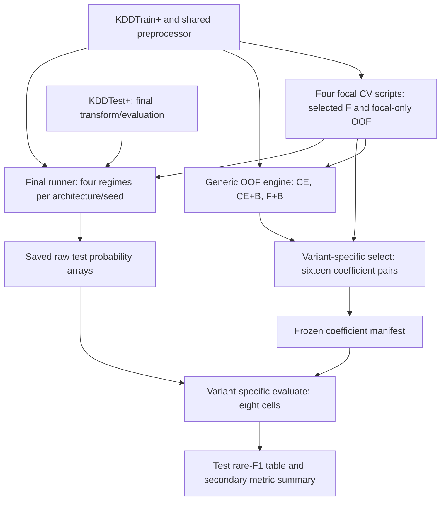

# Paper-to-code reconstruction

Follow-up: the saved prediction arrays have now been independently re-scored on the server, and all 16 scaling searches repeated. See [PAPER_CLAIMS_AND_REVERIFICATION.md](PAPER_CLAIMS_AND_REVERIFICATION.md). The report below records the earlier audit stage.

**Subsequent server evidence:** the complete export supplied all 80 requested metadata records and seven CSVs for selection `ea63ca7e718d` and evaluation `d5c1c2bb3050`. The primary mean/SD pairs, all scaling pairs, all 56 secondary metric entries, and aggregate interaction-table values match the saved seed summaries. All 48 final run records report the intended settings and 25 completed epochs. All eleven core source files match the current server, all sixteen recorded OOF dependency fingerprints were reproduced, and historical F+B worker versions were identified. Direct read-only SSH checks verified all 96 prediction-file hashes. **One methods claim remains unsupported:** the referenced MLP focal OOF protocol evaluates only one pair, rather than the manuscript's claimed eighteen-candidate grid. Three small rounding corrections were also found. See [SERVER_EXPORT_AUDIT.md](SERVER_EXPORT_AUDIT.md). Statements below about missing results and source-derived expectations describe the initial inspection; consult the new audit for recovered evidence and discrepancies.

This review uses the complete supplied LaTeX manuscript, **Understanding Imbalance Control in Rare-Class Intrusion Detection Across Neural Architectures**, rather than only its abstract. The attached manuscript has 3,735 lines and nine result/method tables. Its exact hash, parsed numbers, local source imports and classification are recorded in [paper_code_lineage.json](paper_code_lineage.json). All 57 files in `src/` are classified in [paper_source_classification.csv](paper_source_classification.csv).

## What the paper actually studies

The paper studies the behavior of three established controls under a shared experimental protocol: guaranteed R2L/U2R exposure in mini-batches (B), Class-Balanced Focal Loss (F), and independently fitted class-score divisors (S). It crosses their on/off states over four approximately parameter-matched backbones: Conv2D, Conv1D, a feature-token Transformer and MLP. It is a no-CTGAN, closed-set five-class NSL-KDD study. It does not report synthetic-data generation, XGBoost, safe-stack fusion, a calibrated super-stack, or a new ensemble detector.

The primary result is Rare Macro-F1, the mean of R2L F1 and U2R F1, rather than overall accuracy. The paper uses:

- The implemented taxonomy with `httptunnel` in R2L: 995/52 R2L/U2R training records and 2,887/67 test records.
- 121 encoded predictors, with training-partition-only preprocessing.
- 18 ordinary-batch focal candidates per backbone, evaluated with four fixed stratified folds, three seeds and 25 fixed epochs. This is 864 Stage-1 fits across four backbones.
- One selected beta/gamma pair per backbone, reused in every focal-enabled regime.
- Four underlying regimes: ordinary CE, focal only, CE+B and F+B.
- An independent 24x24 divisor search for every architecture/regime, using saved OOF probabilities and one shared selected pair across the three seeds.
- Four final underlying networks per architecture/seed: 48 required final fits and 96 raw/scaled evaluations.

The supplied paper already explicitly describes the taxonomy choice, replacement filling of batches, fixed focal settings versus separately fitted decision settings, OOF selection optimism, descriptive architecture SD, and descriptive interaction formulas. These clarifications were not available from the abstract alone.

## What the reported numbers say

| Configuration | OOF architecture mean (%) | Test architecture mean (%) |
|---|---:|---:|
| Baseline | 65.91 | 21.46 |
| Focal only | 70.36 | 26.14 |
| Batching only | 67.54 | 29.74 |
| Scaling only | 70.54 | 24.07 |
| Focal + batching | 60.39 | 31.00 |
| Focal + scaling | 71.02 | 25.57 |
| Batching + scaling | 71.91 | 30.56 |
| All three controls | 70.92 | 30.45 |

The main pattern is a distribution-dependent ranking. B+S leads OOF selection, whereas F+B leads the official test architecture mean. F+B has poor raw OOF Rare-F1 relative to several alternatives but a stronger test result. Thus the paper is about intervention consistency and interactions under the official benchmark shift, not the claim that one architecture or one combined pipeline universally wins.

| Backbone | Highest printed test configuration | Rare Macro-F1 (%) |
|---|---|---:|
| Conv2D | Focal + batching | 31.72 |
| Conv1D | Batching only | 32.77 |
| Transformer | Focal + batching | 32.23 |
| MLP | All three controls | 31.86 |

The MLP all-three value is only 0.02 points above B+S, and Conv1D batching alone is only 0.08 above B+S. These are observed rankings, not established significant differences. B's positive marginal contrast for every backbone also does not mean every individual B-enabled cell exceeds its matched non-B cell.

I extracted all 64 architecture/configuration means and seed SDs from the two primary manuscript tables. Their reported architecture means and sample SDs agree with calculations from the printed cells within rounding. The printed test contrasts are likewise consistent:

| Contrast | Recomputed from printed cells (pp) | Paper (pp) |
|---|---:|---:|
| F marginal | +1.8331 | +1.83 |
| B marginal | +6.1269 | +6.13 |
| S marginal | +0.5756 | +0.58 |
| F x B | -2.5113 | -2.51 |
| F x S | -2.2788 | -2.28 |
| B x S | -0.8863 | -0.89 |
| F x B x S | +1.8075 | +1.81 |

All four printed B marginal contrasts are positive. All four architecture-specific test winners include B. The OOF pairwise and three-way contrasts also agree within the precision available in the rounded cells. This checks manuscript arithmetic, **not the correctness of predictions or original runs**. The paper says its contrasts used unrounded means; only rounded means are provided here.

The class-specific secondary table attributes most of the improvement to U2R: baseline versus F+B shows U2R F1 increasing from 21.80 to 38.99, while R2L F1 changes from 21.12 to 23.02. This aligns with the sampler's much larger relative exposure increase for U2R.

## The eleven-file core

These files form the source dependency closure of the identified focal-selection, final-fit and factorial-scoring engines. This was checked with the AST of every source file, including imports inside worker functions. No model training was needed for this dependency analysis.

| File | Exact role in this paper |
|---|---|
| [run_no_ctgan_model_ablation_4gpu.py](../src/run_no_ctgan_model_ablation_4gpu.py) | Shared five-class mapping, fixed categorical schema, fold preprocessor, feature order, effective-number weights, metric calculation and artifact utilities. The paper imports these helpers; this file's own older 80/20 checkpointed main is not the described four-fold protocol. |
| [cnn_gan_foc.py](../src/cnn_gan_foc.py) | Supplies `ClassBalancedFocalLoss` at line 298. The CTGAN generation/main functions are not part of this paper's data path, but this file remains a required import. |
| [cnn_opt.py](../src/cnn_opt.py) | Supplies `BalancedBatchSequence` at line 518 and the matched Conv2D builder at line 600. Its own legacy GAN training CLI is not the paper experiment. |
| [cnn_opt_1d_4gpu.py](../src/cnn_opt_1d_4gpu.py) | Supplies `build_vanilla_transformer` at line 87, `build_opt_cnn_1d` at line 201 and `build_opt_mlp` at line 270. Its old mirrored-GPU/CTGAN main is not the paper experiment. |
| [tune_conv2d_focal_cv_4gpu.py](../src/tune_conv2d_focal_cv_4gpu.py) | Conv2D Stage-1 focal search and selected focal-only OOF probabilities. |
| [tune_conv1d_focal_cv_4gpu.py](../src/tune_conv1d_focal_cv_4gpu.py) | Conv1D Stage-1 focal search and selected focal-only OOF probabilities. |
| [tune_transformer_focal_cv_4gpu.py](../src/tune_transformer_focal_cv_4gpu.py) | Transformer Stage-1 focal search and selected focal-only OOF probabilities. |
| [tune_mlp_focal_cv_4gpu.py](../src/tune_mlp_focal_cv_4gpu.py) | MLP Stage-1 focal search and selected focal-only OOF probabilities. |
| [tune_conv2d_score_scaling_cv_4gpu.py](../src/tune_conv2d_score_scaling_cv_4gpu.py) | Generic OOF training/scoring engine for all four backbones, despite its Conv2D name. Provides CE, CE+B and F+B OOF sources, complete fold reconstruction, the common coefficient grid and score-pair metrics. Also imports all four focal modules for backbone settings/fold helpers. |
| [run_final_baseline_vs_full_kddtest_4gpu.py](../src/run_final_baseline_vs_full_kddtest_4gpu.py) | Final full-KDDTrain network fits and saved KDDTest probability arrays for `baseline`, `focal_only`, `batch_only` and `full`. Raw probabilities from `full` supply the F+B regime. |
| [tune_variant_specific_score_scaling.py](../src/tune_variant_specific_score_scaling.py) | The closest direct producer of the paper's final tables: `select` chooses sixteen independent coefficient pairs and writes the eight-cell OOF tables; `evaluate` applies the frozen pairs to saved test arrays and writes the eight-cell test tables and secondary metric summaries. |

**A misleading filename does not make a file redundant.** In particular, deleting `cnn_gan_foc.py` because the paper says no CTGAN would break the focal-loss imports. Deleting the old-looking `run_no_ctgan_model_ablation_4gpu.py` would remove the shared clean preprocessor and metric functions. These files contain both reused functions and inactive historical entry points.

The core dependency flow is:



The shared loss, sampler and backbone modules support the fitting nodes. KDDTest is not an input to coefficient selection in this code flow.

## Twenty launchers: relevant but interchangeable

These launchers call the generic engines rather than define another experimental method. A convenience wrapper can have been the actual historical command even though it is unnecessary in a minimal package using explicit engine arguments. Without the run manifest/logs, calling one of these “definitely never used” would be unjustified.

| Family | Files/count | Meaning |
|---|---|---|
| Ordinary CE OOF | `run_{conv2d,conv1d,transformer,mlp}_baseline_cv_4gpu.py` (4) | Four pure baseline launchers. |
| CE+B OOF | `run_{conv2d,conv1d,transformer,mlp}_batch_baseline_cv_4gpu.py` (4) | Four batching-only launchers. |
| F+B raw OOF | `run_{conv2d,conv1d,transformer,mlp}_focal_batch_cv_4gpu.py` (4) | Raw F+B fallback sources accepted by the variant-specific selector. |
| CE OOF plus old scaling search | `tune_{conv2d,conv1d,transformer,mlp}_baseline_score_scaling_cv_4gpu.py` (4) | Alternative producers of the baseline OOF pointer family; their standalone scaling search is redundant when the final per-regime selector does the common-grid search. |
| Original F+B OOF search | `tune_{conv1d,transformer,mlp}_score_scaling_cv_4gpu.py` (3) | Architecture wrappers for the F+B engine. Conv2D uses the core engine directly. The selector prefers this `balanced_score_scaling` source when present. |
| Single-enhancement final fits | `run_final_single_enhancements_kddtest_4gpu.py` (1) | Wrapper providing focal-only and batch-only test probability arrays, plus an older scaling-only fit that the final factorial scorer does not need. |

The four `run_*_focal_batch_cv_4gpu.py` wrappers are alternatives to the preferred F+B source, not an extra factorial dimension. The four baseline score-scaling wrappers are alternatives to ordinary baseline launchers. It is not necessary to run every wrapper.

## The direct paper-table/output correspondence

| Manuscript table | Code and expected artifact |
|---|---|
| `tab:class_counts` | `core.load_collapsed_nsl_kdd`, counting the two raw dataset files under the adopted map. |
| `tab:architectures` | The four shared model builders and their expected parameter counts in focal/final settings. |
| `tab:focal_parameters` | Four focal CV searches: selected best-config JSONs referred to by `{architecture}_focal_stage1_latest.json`. Their beta/gamma values match the final runner's constants exactly. |
| `tab:score_parameters` | `tune_variant_specific_score_scaling.py select`: `variant_specific_scaling_selection_<id>_selected_coefficients.csv`. |
| `tab:oof_results` | Same `select` phase: `..._validation_rare_f1_table.csv`, from `..._validation_seed_metrics.csv` and `..._validation_summary.csv`. |
| `tab:test_results` | `tune_variant_specific_score_scaling.py evaluate`: `variant_specific_scaling_kddtest_<id>_rare_f1_table.csv`. |
| `tab:architecture_summary` | Mean/min/range/sample SD calculated from the four unrounded architecture means in the test summary. Mean/SD also appear in the generic rare-F1 table. There is no separate dedicated min/range manuscript analysis module in this checkout. |
| `tab:secondary_test` | Per-architecture per-seed metric fields from the evaluate phase's `..._seed_metrics.csv` / `..._summary.csv`, averaged equally across the four architectures. |
| `tab:factorial_interactions` | Arithmetic over the eight unrounded OOF/test architecture means. The matching stand-alone interaction-analysis script is not checked in. The manuscript gives its formulas, and the current audit helper independently reproduces them from the rounded printed tables. |

The final step from output CSV to formatted LaTeX tables is not recorded as a dedicated manuscript-generation pipeline. Some tables could have been assembled manually or by an external analysis. The source-to-output mapping is established; the exact historical export command is not.

### Why the final runner alone is insufficient

The paper's F+B score divisors differ from the final runner's old built-in divisors:

| Backbone | Old final-runner divisors (R2L, U2R) | Paper's independently selected divisors |
|---|---|---|
| Conv2D | (1.00, 4.00) | (1.15, 8.00) |
| Conv1D | (1.00, 7.00) | (1.30, 8.00) |
| Transformer | (1.00, 10.00) | (1.00, 10.00) |
| MLP | (0.40, 1.90) | (1.45, 4.50) |

This is strong evidence that the paper's scaled cells cannot come directly from the older final runner's own summary alone. The variant-specific evaluator deliberately reads `raw_predictions` and raw probability arrays, then recomputes both raw and scaled cells. It can reuse the old `full` arrays without inheriting their old scaled decisions.

Do not mistake an old `scaling_only` final fit for the paper's independently tuned scaling-only result. The paper's scaled baseline is computed from the baseline source's probabilities with its own selected coefficients.

## Expected inputs that determine exact historical provenance

The variant selector explicitly resolves these OOF pointer families for each architecture:

| Regime | Pointer read | Probability filename |
|---|---|---|
| CE | `{architecture}_baseline_cv_latest.json` | `seed_<seed>_oof_probabilities.npz` |
| Focal only | `{architecture}_focal_stage1_latest.json` and its best-config JSON | `<config_id>_s<seed>_oof_predictions.npz` |
| CE+B | `{architecture}_batch_baseline_cv_latest.json` | `seed_<seed>_oof_probabilities.npz` |
| F+B | Prefer `{architecture}_balanced_score_scaling_latest.json`; fall back to `{architecture}_focal_batch_cv_latest.json` | `seed_<seed>_oof_probabilities.npz` |

The frozen manifest `variant_specific_scaling_selection_<id>.json` records the precise pointer, OOF file, protocol and hash used for each architecture/regime/seed. Its latest pointer is `variant_specific_scaling_selection_latest.json`.

The evaluate phase searches for saved final arrays whose filename ends in `_<architecture>_<variant>_s<seed>.npz`, inside prediction directories and with `kddtest` in the filename. Its variant mapping is CE -> `baseline`, focal -> `focal_only`, CE+B -> `batch_only`, F+B -> `full`. Its `..._protocol.json` records all selected test source paths and hashes; `variant_specific_scaling_kddtest_latest.json` points to that protocol and tables.

Those modern pointer/NPZ/manifest/result files are absent from the current `results/` tree. Git history for `results/` contains the old thesis outputs and an old CNN grid plan, not modern factorial prediction bundles. Thus I can establish the matching scientific protocol, function dependencies, expected artifact paths and arithmetic of the supplied paper. I cannot certify the exact command line, training attempt, machine or file hashes that historically generated its numbers without those recorded outputs.

The source history is nevertheless informative: the focal searches were added in early August 2026; the final runner in August; the variant-specific selector and its tests were added in commit `a9e373c` on September 3, followed by `5ce5872` to accept a narrow older F+B OOF protocol schema. This supports the interpretation that the latest selector reused earlier OOF/final runs. Commit history proves when code was introduced, not when every experiment was executed.

## Twenty-six source files outside this paper's numerical pipeline

These are archive candidates for a package focused on the supplied paper. They are not imported by the eleven-file paper core, and their entry-point methods do not match the manuscript's reported numerical experiment. They may have been used during development, may support another project, or may remain useful. Nothing has been deleted or moved.

| Group | Files |
|---|---|
| Original training entry points | `cnn_baseline.py`, `cnn_focal.py`, `cnn_fin.py`, `transformer_baseline.py` |
| XGBoost and older architecture comparisons | `cost_sensitive_xgboost.py`, `compare_all_models.py`, `compare_cnn_1d_2d.py`, `compare_cnn_opt_xgboost.py`, `add_transformer_to_model_comparison.py` |
| Earlier searches and report utilities | `grid_search_cnn_opt_4gpu.py`, `random_search_cnn_opt_1d.py`, `evaluate_cnn_grid_winner.py`, `tune_cnn_opt_thresholds.py`, `summarize_trials.py` |
| Other ablation/CTGAN studies | `run_cnn_ablation_4gpu.py`, `run_ctgan_amount_sweep_4gpu.py`, `sweep_fixed_backbone_imbalance_4gpu.py` |
| Safe-fusion study | `tune_conv2d_safe_stack_fusion.py`, `tune_conv1d_safe_stack_fusion.py`, `tune_transformer_safe_stack_fusion.py`, `tune_mlp_safe_stack_fusion.py` |
| Super-stack selection and evaluation | `tune_robust_calibrated_super_stack_all.py`, `select_fusion_against_all_validation_baselines.py`, `evaluate_final_simple_average_vs_safe_stack_kddtest.py`, `evaluate_final_natural_rare_super_stack_kddtest.py`, `audit_validation_filtered_fusion_kddtest.py` |

For a minimal paper source package, retain the eleven core files and any preferred launchers. Keep `tests/test_variant_specific_score_scaling.py` as relevant verification. The four other test modules verify the separate fusion work; if archiving that work, archive its tests with it so full test discovery does not keep importing moved modules.

## Other repository assets

The active numerical inputs are `data/KDDTrain+.txt` and `data/KDDTest+.txt`. The three historical image-label CSVs and the 63 rendered images are not loaded by this numerical pipeline. Likewise, the old roughly55k-weight HDF5 model, old accuracy/ROC/confusion images, training logs and grid-plan CSV are not the source artifacts for the supplied tables.

The supplied LaTeX defines its backbone/pipeline figures using TikZ. It does not include the old repository PNG figures. Its external image references are a class-distribution PDF and three author portraits, none present at the repository root. The class-distribution PDF has a fallback placeholder. Figure compilation assets and numerical model inputs are separate requirements.

The MLP focal Slurm template can launch one relevant focal search. The older baseline/Conv1D/random-search Slurm templates launch other protocols. Templates alone cannot establish which jobs generated the manuscript tables. Existing review files under `analysis/` and VS Code settings were created for this audit/editor task, not to produce the original paper numbers.

## A direct reconstruction route with the core files

This is a source-derived route consistent with the paper, not a claim that these exact commands were executed historically. No training was started during this analysis. Four GPU IDs below are examples for an allocation with four visible GPUs; the current Conv2D focal engine requires four.

1. Run each of the four `tune_<architecture>_focal_cv_4gpu.py` searches with the paper's default folds/seeds/budget. Retain the selected focal-only OOF arrays. The paper's winning pairs are beta0.99, gamma0.50/0.25/0.75/0.25 in Conv2D/Conv1D/Transformer/MLP order.
2. For each architecture, run the generic engine in `baseline_ce`, `baseline_batch` and `focal_balanced` modes. F+B must use the matching selected focal parameters. The engine's default architecture prefixes match the pointer families the selector reads.

For example, the three Conv2D OOF regimes can be requested directly without convenience wrappers:

```bash
python src/tune_conv2d_score_scaling_cv_4gpu.py --architecture conv2d --training-mode baseline_ce --coefficient-values 1.0 --gpus 0 1 2 3
python src/tune_conv2d_score_scaling_cv_4gpu.py --architecture conv2d --training-mode baseline_batch --coefficient-values 1.0 --gpus 0 1 2 3
python src/tune_conv2d_score_scaling_cv_4gpu.py --architecture conv2d --training-mode focal_balanced --cb-beta 0.99 --focal-gamma 0.50 --coefficient-values 1.0 --gpus 0 1 2 3
```

3. Freeze the independently selected sixteen coefficient pairs:

```bash
python src/tune_variant_specific_score_scaling.py select
```

4. Produce the four required final training regimes in one invocation:

```bash
python src/run_final_baseline_vs_full_kddtest_4gpu.py --variants baseline focal_only batch_only full --gpus 0 1 2 3
```

5. Produce the paper's final eight-cell tables from raw saved probabilities:

```bash
python src/tune_variant_specific_score_scaling.py evaluate
```

6. Calculate manuscript min/range/interaction tables from the unrounded CSV means and archive the exact source/output hashes. The audit's `map_paper_to_code.py` checks only the supplied manuscript's rounded arithmetic; it cannot replace that original-prediction step.

If all searches are fresh and the chosen focal-only OOF arrays are reused, the implied budget is 864 focal-search fits +144 additional three-regime OOF fits +48 final fits =1,056 network fits. Score-grid searches add no network fits. Running both historical final wrappers with their defaults instead would request 24 baseline/full fits plus36 single-enhancement fits, including12 unnecessary scaling-only CE fits. The manuscript's 48-fit design describes the four needed regimes; absent logs cannot establish whether additional historical executions occurred.

The appropriate next cleanup is an archive/packaging decision based on this map, not deletion based on filename. The source trace preserves the distinction between shared functions, the commands that launch them, optional alternate routes, and research outside the supplied paper.
